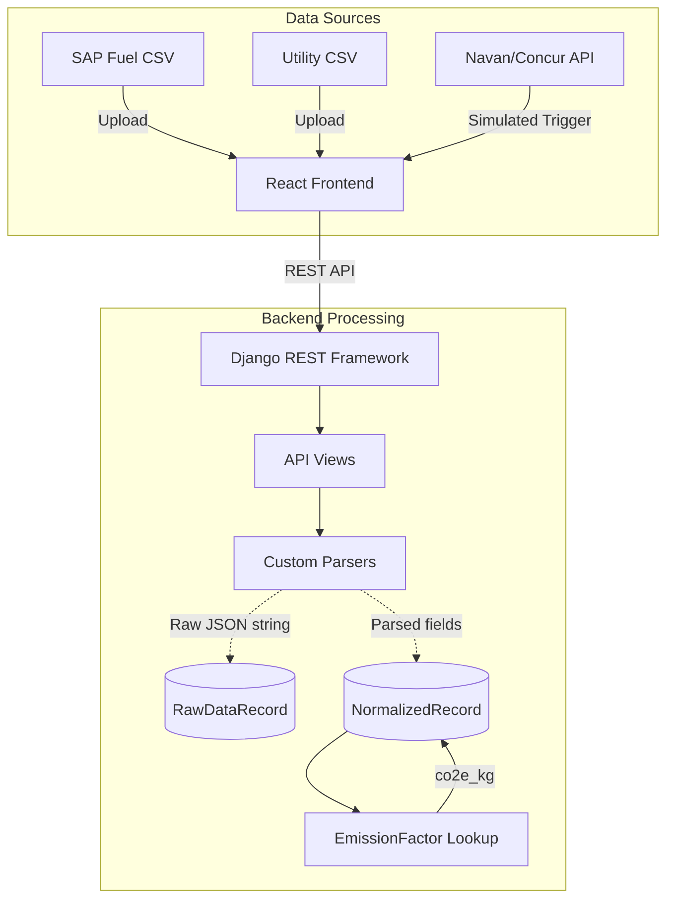

# Breathe ESG — Data Ingestion & Review Platform


A full-stack prototype application developed for the Breathe ESG Tech Intern Assignment. This platform is designed to ingest messy, unstandardized enterprise data from various sources, normalize it into a unified carbon accounting format, and provide a sleek dashboard for analysts to review, flag, and approve data before it goes to auditors.

---

## 🎯 Project Objectives

1.  **Ingest Diverse Data Shapes**: Handle three vastly different data sources (SAP flat files, Utility CSVs, and Travel APIs) with their own quirks and irregularities.
2.  **Robust Normalization**: Convert varying units (e.g., gallons to litres, varying date formats) and calculate accurate CO2e emissions using reliable emission factors.
3.  **Auditability & Source-of-Truth**: Maintain strict traceability by storing the original, immutable raw data payload alongside the normalized, editable records.
4.  **Analyst Workflow**: Provide a modern, responsive UI where analysts can spot anomalies, view warnings, and bulk-approve rows.

---

## 🏛️ System Architecture

The application follows a standard decoupled architecture:



### Tech Stack Deep Dive
*   **Backend Layer**: `Django 6.0` & `Django REST Framework`. Chosen for its robust ORM, built-in admin panel, and rapid API development capabilities.
*   **Database Layer**: `SQLite3` for this prototype (easily swappable to PostgreSQL via `dj-database-url` for cloud deployment).
*   **Frontend Layer**: `React` powered by `Vite`. Uses `Recharts` for data visualization, `lucide-react` for iconography, and `date-fns` for client-side date formatting.
*   **Aesthetics**: 100% custom CSS using modern variables, Flexbox/Grid layouts, and a clean "emerald & slate" corporate dashboard design language. No bloated UI libraries.

---

## 🧩 The Three Data Sources

We handle three distinct, realistic data shapes. *(See [SOURCES.md](./SOURCES.md) for detailed research on these formats).*

### 1. SAP Fuel & Procurement (CSV)
*   **The Challenge**: SAP IS-Oil flat file exports often contain localized formatting (e.g., German numbers like `12.500,00` and dates like `14.01.2024`), internal plant codes (`WERK_001`), and ambiguous units.
*   **The Solution**: A custom `safe_decimal` parser using RegEx to disambiguate European vs. US thousands separators, flexible date parsing, and a lookup mapping plant codes to actual `Facility` records.

### 2. Utility Portal Data (CSV)
*   **The Challenge**: Electricity bills rarely align with calendar months (e.g., billing from the 14th to the 13th). Units can vary drastically (kWh, MWh, Therms).
*   **The Solution**: We store explicit `activity_date_start` and `activity_date_end` bounds rather than a generic "month" field. Non-calendar periods are flagged with an informational warning. We also handle negative consumption values representing solar net-metering credits.

### 3. Corporate Travel (JSON API)
*   **The Challenge**: Simulating a Navan/Concur API pull. Flight APIs rarely provide carbon emissions or even distance; they just provide origin/destination IATA codes and cabin class.
*   **The Solution**: We implemented a Great-Circle (Haversine) distance calculator mapped to a dictionary of IATA coordinates. We add a 10% uplift factor to account for flight routing inefficiency, then map the distance and cabin class to specific DEFRA 2023 emission factors.

---

## 📂 Design Deliverables

As requested by the PM prompt, the core architectural and product decisions are extensively documented in the root directory:

*   📖 [MODEL.md](./MODEL.md) — The data model, multi-tenancy logic, and audit trail lineage (Source-of-truth).
*   🤔 [DECISIONS.md](./DECISIONS.md) — What subset of data was chosen to be handled, what was ignored, and how ambiguities were resolved.
*   ⚖️ [TRADEOFFS.md](./TRADEOFFS.md) — What we deliberately omitted (Auth, Temporal Factors, Async Queues) and why.
*   🔍 [SOURCES.md](./SOURCES.md) — Real-world format research, what our sample data looks like, and what would break in a real deployment.

---

## 🗄️ Core Data Models

1.  **`Tenant` / `Facility`**: Ensures row-level multi-tenancy isolation.
2.  **`DataImport`**: Tracks a specific file upload or API pull event, creating an audit lineage back to the source.
3.  **`RawDataRecord`**: The **immutable** source of truth. We save the original parsed row (from CSV/JSON) as a serialized JSON string here before any normalisation occurs.
4.  **`NormalizedRecord`**: The editable analyst view. It contains strict data types, converted SI units, computed CO2e, and the review workflow state (`PENDING`, `APPROVED`, `FLAGGED`, `ERROR`).
5.  **`EmissionFactor`**: A lookup table keyed by `(category, unit)` mapping to `kg_co2e_per_unit`. Sourced from DEFRA 2023 and India CEA.

---

## 🚀 Local Setup & Run Instructions

A set of automated start scripts have been provided for effortless local execution.

### Prerequisites
*   **Python 3.10+**
*   **Node.js 18+**

### Windows
Double-click `start.bat` in the file explorer, or run it via terminal:
```cmd
.\start.bat
```
*(This script will automatically create a Python `venv`, install backend dependencies, apply Django migrations, load emission factor fixtures, install `node_modules`, and start both the backend and frontend in separate console windows).*

### macOS / Linux / WSL
Make the script executable and run it:
```bash
chmod +x start.sh
./start.sh
```

### Accessing the Application
*   **Frontend Dashboard**: [http://localhost:5173](http://localhost:5173)
*   **Backend API**: [http://localhost:8000/api/](http://localhost:8000/api/)
*   **Django Admin Panel**: [http://localhost:8000/admin](http://localhost:8000/admin) *(Username: `admin` | Password: `admin`)*

---

## 🧪 Testing the Workflow

1.  **Open the App**: Navigate to [http://localhost:5173](http://localhost:5173).
2.  **Ingest Data**:
    *   Click on **Ingest Data** in the sidebar.
    *   Under **SAP Flat File**, upload `sample_data/sap_fuel_export.csv`.
    *   Under **Utility Portal Data**, upload `sample_data/utility_electricity.csv`.
    *   Under **Corporate Travel**, click "Trigger API Pull".
3.  **Review & Approve**:
    *   Navigate to **Review & Approve**.
    *   You will see the parsed rows categorized by status. 
    *   Hover over the orange/red warning badges to see what anomalies the parser caught (e.g., non-calendar billing cycles, missing IATA codes, European number translations).
    *   Use the checkboxes to bulk-approve records, or approve them individually using the green checkmark icon.
4.  **View the Overview Dashboard**:
    *   Navigate back to the **Dashboard**.
    *   See the aggregated carbon footprint updated in real-time based on the applied emission factors, broken down by Scope 1, 2, and 3.

---

## 🔌 API Endpoints Reference

| Method | Endpoint | Description |
| :--- | :--- | :--- |
| `POST` | `/api/ingest/sap/` | Multipart form upload for SAP CSVs |
| `POST` | `/api/ingest/utility/` | Multipart form upload for Utility CSVs |
| `POST` | `/api/ingest/travel/` | Triggers a simulated pull of Navan API JSON data |
| `GET` | `/api/records/?tenant=1&status=PENDING` | Fetch NormalizedRecords with filtering |
| `PATCH`| `/api/records/<id>/` | Edit a specific record |
| `POST` | `/api/records/bulk-approve/` | Approve multiple records by ID array |
| `GET` | `/api/records/<id>/raw/` | Fetch the immutable RawDataRecord for audit |
| `GET` | `/api/stats/?tenant=1` | Fetch dashboard aggregation statistics |
